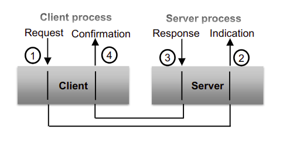

## Client Server Model

- It is a request response model.
- Consists of both client and a server.

__Server__: It is an entity that provides services and listens for requests made for those defined services.

__Client__: Entitty requesting services and knows about the available services.

_Note_: Client server communication model is a variant of P2P communication model.

This is a connection oriented model due to the link between the client and the server.

There could be single or multiple servers in the system.

_Example_: Bluetooth

### Client Server Model Communication primitives

- __Request__, __Indication__, __Response__, __Confirmation__
- __Request__ – Invokes a service
- Higher layers in the server receives the request as an Indication
- __Confirmed service__ – if there is a result sent back to the client
- __Unconfirmed service__ – if there is no result sent back to the client

