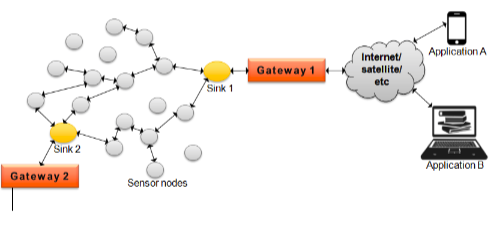

# Communication Models

- They define the ground rules of interaction in a communication network.
- The Models can vary depending on the application reqquirement.

The intent of a communication model is to minimize the communication overhead while at the same time maintaining __data integrity__ and __consistency__.

#### Classification
- Client Server
- Pub Sub
- Peer to Peer
- Exclusive Pair

