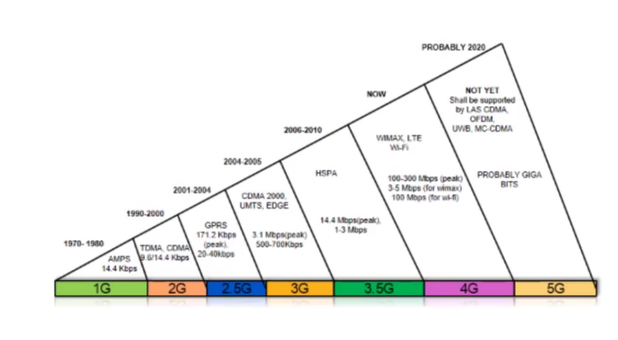
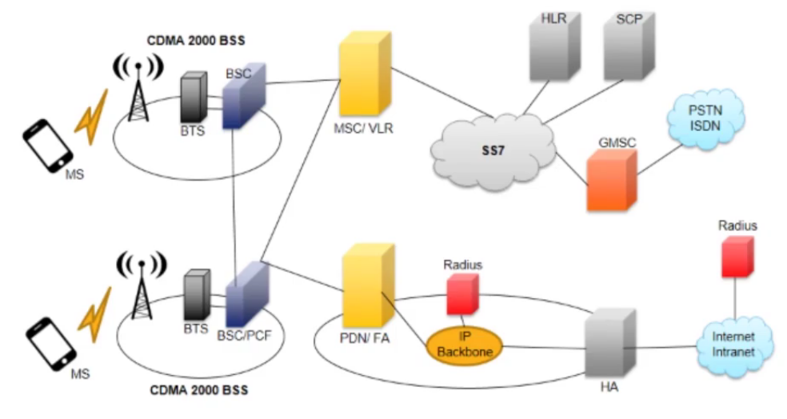
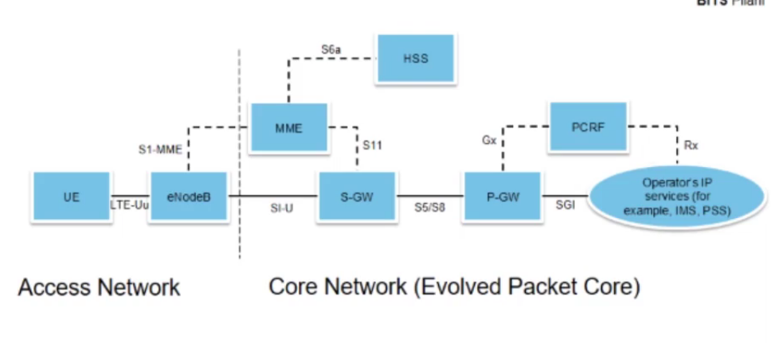

# Wireless broadband access Technology

## CDMA Network Components

## LTE Network components

- UE stands for user equipment (Mobile phone)
- E-UTRAN
  - eNodeB
  - User Equipment

- Core Network (Evolved Packet Core)
  - HSS (Home Location Registry)
  - P-GW and S-GW(Serving ): External packet data networks
  - MME Main signaling node
  - PCRF Policy control and charging rules | Flow based charging etc

- Also supports internetworking(2G/3G) and handoff.

# Satellite Communication Networks

- Need for satellite networks
  - Flexiblity 
  - Mobility
  - Speedy deplpoyment
  - Wider coverage
  
### Disadvantages

- High cost
- Propogation delay