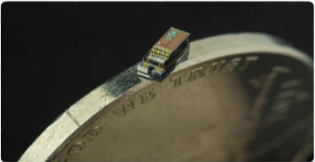
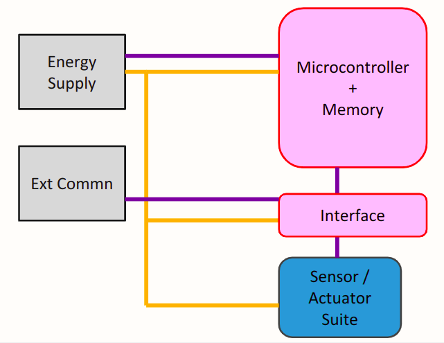
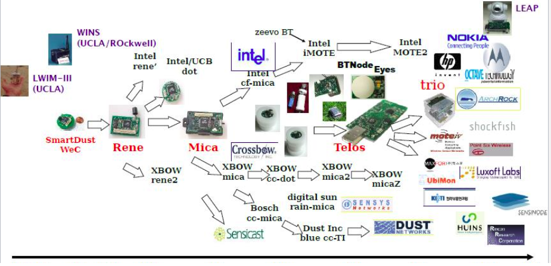

# Motes

Motes are the simplest possible intelligent device which have processing, sensisng and communication in a very small form factor.

Motes usually have small size, long life, ,less cost, limited energy, processing power, limited memory and band width.

_Ex: Michigan Micro Mote –(M3) –2 x 4 x 4 mm3_

### Block Diagram

### Selecting Motes

- Communication interface and range
- Energy consumption
- Deployment span
- sensors 
- Memory 
- Peripherals support

### Diversity and Dynamics of Motes
- In a given system different motes could be used.
- Sensors availability determines preference for a task.

Mote must be very dependant and fault tolerent as 
- They are usually deployed in very harsh environements.
- They can only use wireless medium to communicate due to their size and density of deployment.

### Motes in Market

