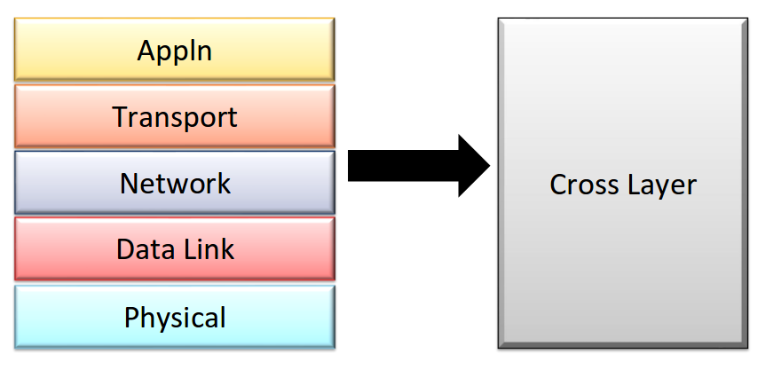
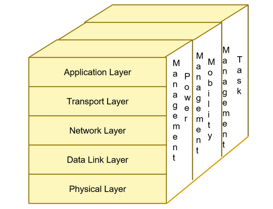

# WSN Protocol stack

Would have the same five layers as TCP/IP.
- They need to be energy constraint
- self managing and self configuring

### Physical Layer
- ISM 2.4Ghz 
- Physical layer similar to Zigbee, LORA, UWB 
- Energy Aware -Short Range, energy levels in modes allow for different power modes.
- Different energy modes have different energy awareness

### Data Link Layer
- Manages Framing, MAC, Error Control, Flow control
- It also has to be energy aware.
  - Collisions
  - Idle listening
  - Overhearing
  - Sleep state
    - over-emitting
- Multi Channel
  - No. of channels that can exist are limited.
- This features allows complexity to DLL.

### Network
-  Different routing protocol for application
-  Data Centric
   -  Energy Aware (Push Arch)
   -  Data Aggregation (Pull arch) 
      -  Reduces network traffic in the network.
- Query Response?

### Transport
- Not very important in WSN
- Needed only for communication with standard infrastructure. Hence, is a redundant layer in wsn.

### Application Layer
- Application governs all the other layers.
- This layer gets distributed among the other layers.
- Hence, it might not appear specifically in the stack for wsn.
- It handles sensor calibration, task management, power management etc.
- Users interface to the WSN.

## Protocol Stack Issues

- It operates in a dynamic environement 
  - Sensor nodes address a dynamic enviroment
    - auto reconfigurable nodes.
    - adapt to changes.
  - Resources are limited
  - Network needs to be capable of adapting to new situations- lower the use of the scarce energy and memory - maintain the integrity of operation.
- power control is needed to ascertain longetivity.
- protocol place in sensor node architecture.
- protocol availability. (Newer protocols are coming in everyday)

### Error control
- normally is present in all protocol layers
- In WSN this redundancy is too expensive
- Adopting a central view on how error control is performed is a much better approach at having error control.
- Hence, it is better to have a cross layer design for wsn.

### Power Control

- traditionally done at physical layer.
- Energy consumption is a major design constraint.

### Protocol Place (Time Sync, geo location)
- Time synchronization, localization, calibration.
- Where do the above algos fit in?
- These information gathered is needed at multiple layers in the protocol stack.
  - Localization can be used at physical layer for geographic based routing.
  - It is also used by the application layer to determine the position of the node that has sensed the information.

### Protocol Availability

- After the network is deployed depending on the network conditions the protocol stack will have to change itself. (_Ex: If low on power it might be difficult for the protocol to handle routing further._)
- Thus different nodes might use different protocol stack that will better suit their goal and environment.
- Hence, changing or updating at run times parts of the software on the nodes is very common in WSN.

Hence, to cater to all the above needs its easier for having a single cross-layer protocol stack in wsn.

### 3D representation of WSN protocol stack.

