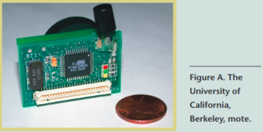
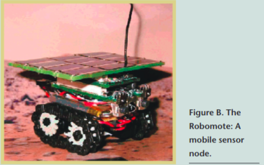

# Robo Mote

Research conducted through the University of California,Berkeley’s DARPA project on SenseIT and ubiquitous com-puting produced a widely-used microsensor node.

The sensor board for the Berkeley platform consists of five differ-ent microsensor modules to support several potential applications.The types of sensors it supports include light, temperature, accel-eration, magnetic field, and acoustic, each of which is available offthe shelf. All modules in the sensor board power cycle indepen-dently and are power isolated from the MICA’s processor throughan analog switch. Finally, the gain of the magnetometer and themicrophone amplification is adjustable by tuning the two digitalpotentiometers over the I2C bus. 

We recently stacked a motor control board on a microsensornode and mounted the resulting assembly on a motorized chassiswith two wheels.1The motor control board regulates wheelspeeds and provides range information from two forward andone rear-looking infrared emitters. The resulting node (see FigureB) is essentially a small mobile robot platform with the same net-work interface as the microsensor nodes.