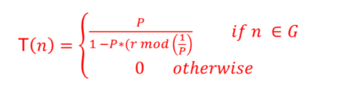

# Routing

## Types

- Proactive
- Reactive
- Multi Hop
- Direct
- Push 
- Pull 

## Routing Algorithm Types
- Optimization based
  - Balances the energy in the network
- Data centric
  - Enures data is aggregated
  - Only meaningful data reaches the destination
- Cluster Based
  - Nodes form cluster
  - Cluster head --> base station
  - Most commonly found in wsn
- Location based
  - Directs the broadcast storm in a certain direction.
  - Is better suited to select neighbour for routing
  - needs localization to work
- QoS Enabled
  - Gauranteed service with conjunction with energy

## Routing -- Performance Criteria
- Hit-Miss Ratio
- Average energy consumption
- Network lifetime
  
## Clustering Based Routing Example(LEACH)
- Leach stands for Low Energy Adaptive Cluster Hierarchy protocol.
- Base station is fixed and is far away from the sensor nodes
- All nodes are energy constrained and homogenous
- Localized clustering
- Local data fusion/aggregation
- Rotatoin of cluster heads takes place.
- Adaptive and rotating clustering algo.
  
### Eligibility for cluster head
- Self evaluation process
- P = desired % of cluster heads
- r = current round
- G - Nodes not yet cluster head in 1/P rounds.
- T(n) - Eligibility score to become the cluster head. (Threshold factor)

Hence, 

Once this phase is done the node will advertise itself as the cluster head.

The nodes which hear this advertisement respond the neighbouring nodes use CSMA MAC protocol to join a cluster.

If a node hears multiple advertisements it will select the cluster head that advertised to the node first.

If a CH node does not hear from other nodes to join it it will attempt to join another cluster.

Once the CHs have all the nodes in place it will create a schedule for nodes in the cluster to send information. This also acts as an acknowledgement for the nodes to join the cluster.

