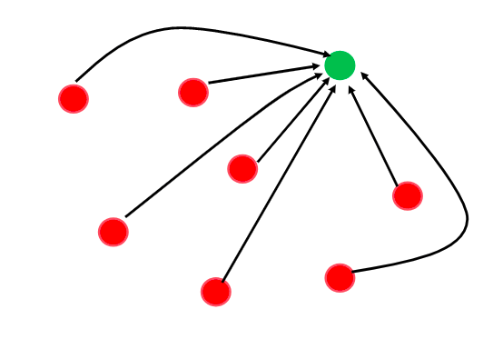
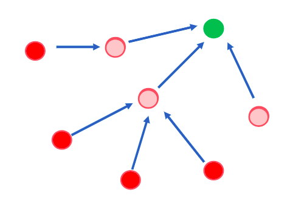
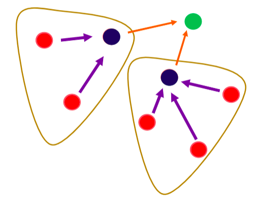
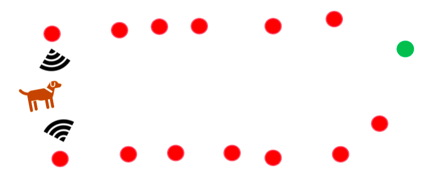

# WSN Deployment

### WSN Classification

- Intelligent warehouses
  - Has limited constraints (power and accessibility.)
  - Used to monitor indoor spaces
  - _Ex: Warehouse monitoring_
- Environmental Monitoring
  - Limited access to power
  - Has constraints in maintenance and accesibility.
  - _Ex: Redwood pine monitoring in australia_
- Very large scale sensor network applications.
  - Long duration monitoring 
  - Mobile

### Important aspects of deployment

- coverage
- connectivity
- topology

### Aspects to consider in WSN Deployment

- Structured vs random deployment
  - More heirarchichal in case of structured deployment.
- Over deployment vs Incremental deployment
  - redundency in case of over deployment
  - cost and complexity rise with over deployment
- Network topology
  - Emerges based on the deployment pattern.
- Homogeneous vs hetrogeneous deployment
  - Depends on the application
  - depends on sensing parameters.
  - So according to application a mote is selected.

### Deployment Patterns

#### Start Topology

The main disadvantage of this deployment pattern is excessive energy consumption for communication with the sink.

#### Multi Hop

The disadvantage in this configuration is that the nodes that are nearer to the sink will be depleted of energy sooner due and this might result in a partition in the network. 

Overall energy consumption will be lesser than start topology.

#### Clustering

There is a two level heirarchy. 

A cluster head rotation happens to balance the energy consumption among nodes.

Scalability and heirarchy built in.

_There is an overhead of managing the process of cluster head election_

#### Data Mule

There is no need to form a network.

Minimal energy is consumed.

_The data mule can be a robot or animal_

Such deployment pattern is not ideal for inaccessible areas.
