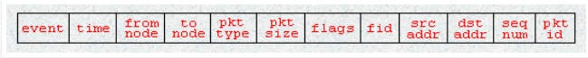

# Trace File

## TRACE FILE DESCRIPTION

### Following list shows the trace file variables and its explanations;

- s - send packet
- r - received packet
- d - packet dropped 
- f - packet forwarded
- c - collision of packet at MAC level
- t - time at which packet tracing started
- Hs - ID of the hop
- Hd - ID of the next hop towards destination 
- Ni - Node ID
- Nx,Ny,Nz - Co ordinates that the nodes situated
- Ne - Node energy level
- Nl - Trace level
- Nw - Reason of the event
- AGT - Agent
- RTR -Routing
- END - DROP End of Simulation
- COL - DROP MAC COLLISION
- DUP - DROP MAC DUPLICATE
- DERR - DROP MAC PACKET ERROR
- RET - DROP MAC RETRY COUNT EXCEED
- STA - DROP MAC INVALID STATE
- BSY - DROP MAC BUSY
- NRTE - DROP RTR - NO ROUTE
- LOOP - DROP RTR ROUTE LOOP
- TTL - DROP RTR TTL has reached Zero
- TOUT - DROP-RTR-QTIME OUT Expired
- Is - Source address of source port
- Id - Destination address of destination port
- Il - Packet Size
- If - Flow ID
- Ii - Unique ID
- Iv - TTL value next hop into
- 
- ### MAC LAYER INFORMATION

- Ma - MAC Layer duration
- Md - Destn. Ethernet Address
- Ms - Source Ethernet Address
- Mt - Ethernet Type

### PACKET INFORMATION

- -P arp - address resolution protocol-Po - ARP Request / Reply
- Pm - Source MAC Address
- Ps - Source Address
- Pa - Destination MAC Address
- Pd - Destination Address
- Pn - Nodes Transversed
- Pq - Flag
- Pi - Route Request Sequence Number/ Sequence Number
- Pp - Flag
- Pl - Reply Length
- Pe - src of source routing
- Pw - Error Report Flag
- Pc - Report to whom 
- Pb - Link error from link a to link b
- -P cbr - CBR data
- Pf - How many level packet leave
- Po - Optimal Number of Forward
- -P TCP - TCP flow
- -Ps - seq. number
- Pu - acknowledgement
- Pf - Packet Failure